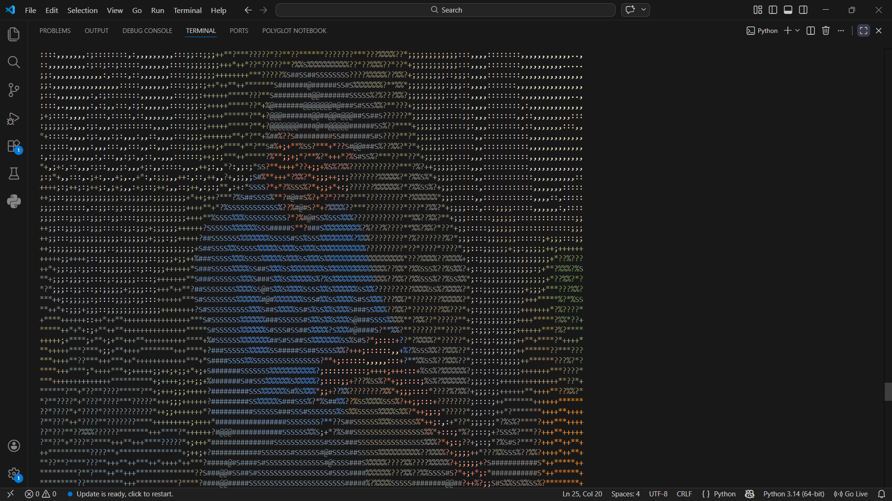

# 🎨 Python ASCII Art Generator

A Python script that takes standard digital images and converts them into text-based ASCII art. This project explores image processing, pixel manipulation, and programmatic visual aesthetics.

### 📸 Conversion Example
| Original Input | ASCII Output |
| :---: | :---: |
|  |  |

### ✨ How It Works
* **Pixel Processing:** The script reads the target image and analyzes the brightness (luminosity) of each individual pixel.
* **Character Mapping:** It maps darker pixels to denser ASCII characters (like `#` or `@`) and lighter pixels to lighter characters (like `.` or `-`).
* **Aspect Ratio Maintenance:** Automatically scales the image down while adjusting the width-to-height ratio so the final text output doesn't look stretched or distorted.

### 🛠️ Built With
* **Python 3**
* **Pillow (PIL):** The Python Imaging Library used for opening and manipulating the digital image data.

### 🚀 How to Run
Ensure you have Python installed, along with the Pillow library. 

1. Clone or download this repository.
2. Install the required image processing library via terminal:
   ```bash
   pip install Pillow
